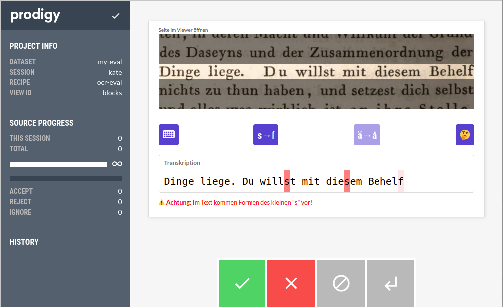

# OCR-Evaluation

Mit diesem "Recipe" können OCR-Daten zeilenweise intellektuell korrigiert und so Ground-Truth-Daten
für die Bewertung der OCR-Qualität erstellt werden. Es basiert auf der
Annotationssoftware [prodigy](https://prodi.gy/).

Zur größtmöglichen Vermeidung von Transkriptionsfehlern werden typische potenzielle OCR-Fehler
automatisch farbig hervorgehoben (z. B. `s` statt `ſ`).

Transkribierende können einzelne Abschnitte als unsicher markieren (🤔), wenn eine Textstelle z.B.
aufgrund von Druckqualität, Schadstellen etc. nicht eindeutig interpretierbar ist.

Um die Eingabe von Sonderzeichen zu vereinfachen, kann eine virtuelle Tastatur mit Sonderzeichen
eingeblendet werden.



## Voraussetzungen

* Python >= 3.10
* Prodigy >= 1.12.5

## Eingabeformat

* Datei im JSONL-Format
* Felder:
    * `volume_id`: Identifier des digitalen Objekts.
    * `page_num`: Identifier der digitalisierten Seite.
    * `context_area`: Seitenausschnitt, der die zu transkribierende Zeile und zusätzlichen Kontext
      für die Transkription enthält. Beschrieben mit `x`,`y`,`width`,`height`.
    * `line_area`: Seitenausschnitt, der die zu transkribierenden Zeile enthält. Beschrieben
      mit `x`, `y`, `width`, `height`.
    * `transcription`: via OCR automatisch erkannter Text der Zeile.
    * `context_image_url`: URL zum Seitenausschnitt mit zusätzlichem Kontext. Wird den Nutzer*innen
      angezeigt, um die Transkription zu erstellen.
    * `line_image_url`: URL zum Seitenausschnitt mit der Zeile. Wird
      verwendet, um die zu transkribierende Zeile im Vollbild anzuzeigen.
    * `viewer_url`: URL zur ganzen Seite im Viewer. Dabei kann die zu
      transkribierende Zeile farblich hervorgehoben sein. Wird unter "Seite im Viewer öffnen"
      verlinkt.

Bsp.:

```json lines
{"volume_id": "bsb10123222", "page_num": 384, "context_area": {"x": 331, "y": 1500, "width": 981, "height": 235}, "line_area": {"x": 1, "y": 94, "width": 980, "height": 47}, "transcription": "Dinge liege. Du willst mit diesem Behelf", "context_image_url": "https://api.digitale-sammlungen.de/iiif/image/v2/bsb10123222_00384/331,1500,981,235/full/0/default.jpg", "line_image_url": "https://api.digitale-sammlungen.de/iiif/image/v2/bsb10123222_00384/332,1594,980,47/full/0/default.jpg", "viewer_url": "https://www.digitale-sammlungen.de/view/bsb10123222?page=384&q=\"Dinge liege. Du willst mit diesem Behelf\""}
{"volume_id": "bsb10123222", "page_num": 384, "context_area": {"x": 332, "y": 1479, "width": 980, "height": 219}, "line_area": {"x": 0, "y": 57, "width": 978, "height": 46},  "transcription": "des Daseyns und der Zusammenordnung der", "context_image_url": "https://api.digitale-sammlungen.de/iiif/image/v2/bsb10123222_00384/332,1479,980,219/full/0/default.jpg", "line_image_url": "https://api.digitale-sammlungen.de/iiif/image/v2/bsb10123222_00384/332,1536,978,46/full/0/default.jpg", "viewer_url": "https://www.digitale-sammlungen.de/view/bsb10123222?page=384&q=\"des Daseyns und der Zusammenordnung der\""}
```

## Konfigurationsmöglichkeiten

* Umgebungsvariable `PRODIGY_POSSIBLE_SESSIONS`: definiert Namen für verschiedene Nutzer\*innen.
  Nutzer\*innen wählen vor Beginn jeder Sitzung einen Namen aus, der mit ihren Korrekturen
  abgespeichert wird.
* Tastatur mit Sonderzeichen: Belegung über Feld `keyboard` in `prodigy.json` konfigurierbar.
* Hilfetext: Pfad zu Text- oder HTML-Datei über Feld `instructions` in `prodigy.json`
  konfigurierbar.
* Weitere Konfigurationsmöglichkeiten
  siehe [prodigy Dokumentation](https://prodi.gy/docs/install#config).

Bsp. für `prodigy.json`:

```json
{
  "feed_overlap": false,
  "instructions": "instructions.html",
  "keyboard": [
    "\u2e17",
    "\u0222",
    "\u0223",
    "\u0370",
    "\u0371",
    "\u0372",
    "\u0373",
    "\u0374"
  ]
}
```

## Benutzung

Installiere Projekt und Abhängigkeiten:

```shell
poetry install
```

Wechsle in das Arbeitsverzeichnis und erstelle die Konfigurationsdatei `prodigy.json` (optional).
Setze die Umgebungsvariable `PRODIGY_POSSIBLE_SESSIONS` mit den erlaubten Nutzernamen und starte
die Anwendung:

```shell
export PRODIGY_POSSIBLE_SESSIONS=layla,kate,maryam
python3 -m prodigy ocr-eval <Name des Datensets> <Pfad zu Eingabedaten>
```

Bsp.:

```shell
python3 -m prodigy ocr-eval my-eval /opt/prodigy/datasets/my-data.jsonl
```

## Ausgabeformat

Standardmäßig speichert prodigy die Daten in einer sqlite Datenbank. Mit dem Befehl `db-out` können
die Daten im JSONL-Format exportiert werden
(siehe [prodigy Dokumentation](https://prodi.gy/docs/recipes#db-out)).

Bsp.:
```shell
prodigy db-out my-eval path/to/output/directory
```


## Lizenz

[MIT License](LICENSE)
